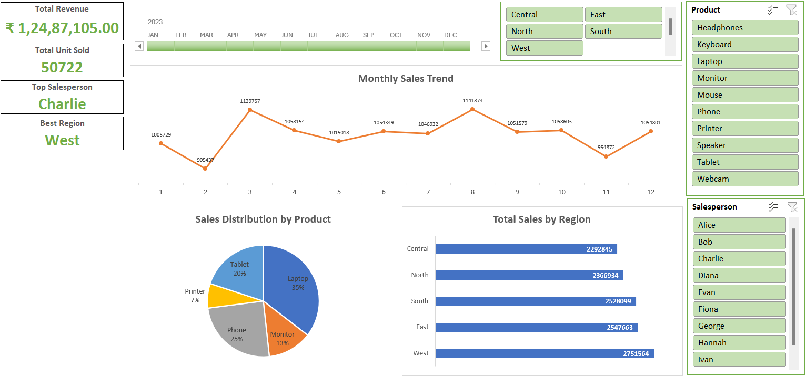

# 📊 Excel Sales Dashboard  
### A clean, interactive & professional dashboard for business insights

---

## 📁 Project Files  
| File | Description |
|------|-------------|
| **Dashboard.png** | High-resolution image of the Excel Dashboard |
| **dataset_and_dashboard.xlsx** | Fully interactive Excel dashboard with dataset, KPIs, charts, slicers & timeline |

---

## 📘 Overview  
This dashboard provides a complete, interactive visualization of sales performance across regions, products, and salespersons. Built using **Microsoft Excel**, it leverages **Pivot Tables, Pivot Charts, Slicers**, and a **Timeline** to deliver insights with clarity and speed.

The layout is optimized for readability, ergonomics, and a clean professional appearance.

---

## 🧱 Dashboard Structure

### 🔹 A. KPI Cards (Top Row)
The top section features key performance indicators for quick business decisions:

- 💰 **Total Revenue**
- 📦 **Total Units Sold**
- 👨‍💼 **Top Salesperson**
- 🌍 **Best Region**

These cards provide high-level yearly performance at a glance.

---

### 🔹 B. Charts & Visual Analytics

#### 📈 Monthly Sales Trend  
A line chart visualizing monthly sales movement for the selected year, helping to spot peaks, dips, and seasonality.

#### 🔷 Total Sales by Region (Bar Chart)  
Shows sales distribution across Central, North, South, East, and West regions.

#### 📊 Sales Distribution by Product (Pie Chart)  
Visualizes contribution of each product category such as Laptop, Phone, Tablet, Printer, and more.

---

### 🔹 C. Interactivity & Filters  

The dashboard includes modern filtering capabilities using **Excel Slicers**:

#### 💠 Slicers  
- Region  
- Product  
- Salesperson  

#### 🗓️ Timeline  
- Sales Date (Monthly View)

These allow users to drill down into specific segments instantly.

---

## ⚙️ Technologies Used
- Microsoft Excel  
- Pivot Tables  
- Pivot Charts  
- Slicers & Timeline  
- Conditional Formatting  
- Dashboard Layout Design  

---

## 🚀 How to Use the Dashboard
1. Open **dataset_and_dashboard.xlsx** in Microsoft Excel.
2. Use the slicers on the right to filter by **Region**, **Product**, or **Salesperson**.
3. Use the timeline at the top to explore results by month.
4. View updated KPIs and charts instantly as filters change.

---

## 📸 Dashboard Snapshot  
Refer to the attached **Dashboard.png** for a visual preview of the complete dashboard.

---

## 📝 Notes  
- All charts dynamically update based on slicer & timeline selections.  
- The dataset is expandable—PivotTables are connected to refreshable data ranges.  
- Designed with an ergonomic, clean, and modern layout for professional reporting.
